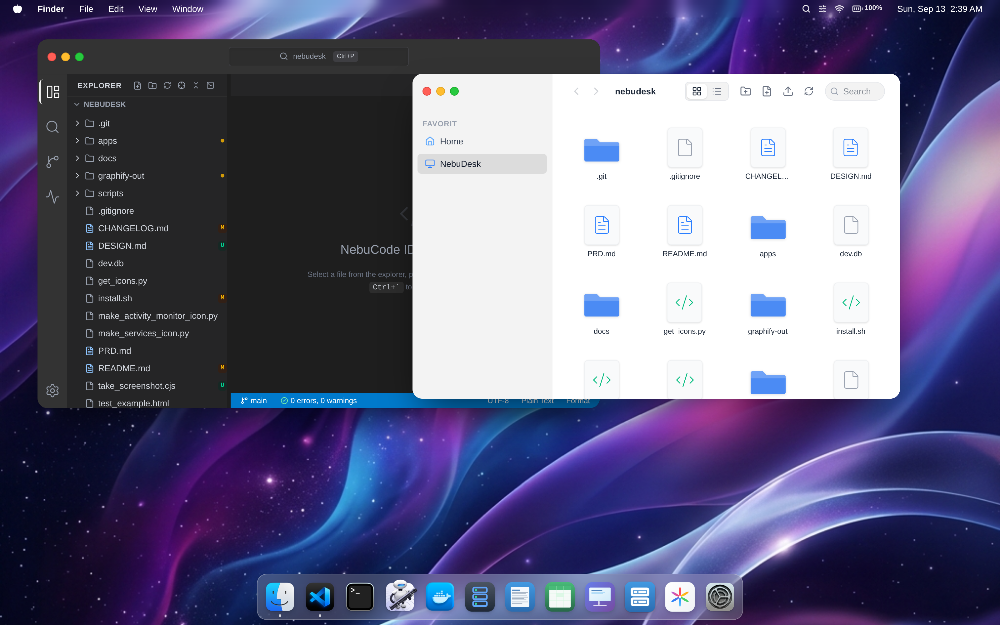

<div align="center">
  

  <br /><br />

  # 🌌 NebuDesk
  
  **Your Lightweight Linux Server Desktop & Development Environment**

  [](https://nodejs.org/)
  [](https://reactjs.org/)
  [](https://fastify.dev/)
  [](https://tailwindcss.com/)
  [](https://opensource.org/licenses/MIT)

  *NebuDesk transforms Linux Server Administration and Cloud Development into a familiar, high-performance Desktop Experience accessible directly from any web browser.*
</div>

---

## ✨ Key Features

NebuDesk brings a full-featured, macOS-like development environment straight to your VPS or cloud instance without the bloat of heavy virtualization or remote desktop protocols.

| 💻 **NebuCode IDE** | ⚡ **Developer Workflow & Web Preview** |
| :--- | :--- |
| **Monaco Editor Core**: VS Code-class syntax highlighting and code editing.<br>**Autosave & Dirty State**: 1.5s debounced autosave with visual unsaved change indicators.<br>**Persistent Terminal**: Background PTY terminal sessions that persist through reconnects.<br>**Workspace Search**: Fast file search with automatic `node_modules` exclusion. | **Smart Port Detection**: Automatically detects listening dev servers (Vite, Next.js, etc.) in your workspace.<br>**PORTS Panel**: Monitor listening ports, PIDs, and process names.<br>**Live Web Preview**: Direct side-by-side iframe preview with seamless WebSocket HMR.<br>**Open External**: One-click opening in your client's local browser via Tailscale/LAN URL resolution. |

| 🎛️ **App Manager & Reverse Proxy** | 📁 **Finder & NebuDocs Suite** |
| :--- | :--- |
| **Smart Discovery**: Automatically monitors Docker containers & PM2 processes.<br>**Lifecycle Control**: Start, Stop, and Restart services with real-time logs.<br>**Automated Reverse Proxy**: Auto-generates Caddy and Nginx proxy blocks.<br>**Cloudflare Integration**: Provisions DNS A-records with 1-click. | **macOS-Style Finder**: Browse, upload, download, and manage server files securely.<br>**NebuDocs**: Rich text editor synced to local SQLite database.<br>**NebuSheet**: Lightweight spreadsheet tool for managing tabular data.<br>**NebuSlides**: Build presentations directly on your server. |

---

## ⚡ Performance & Low Resource Footprint

NebuDesk is purposefully engineered for small VPS instances (even 1 vCPU / 1GB RAM):
- **Ultra-Low Memory Usage**: Backend (~25-75 MB RAM) and Frontend (~60 MB RAM) keep total consumption under ~150 MB.
- **No Headless Chromium Overhead**: Unlike traditional web desktops that run heavy browser daemons server-side, NebuDesk leverages your PC's browser directly via live Web Preview and dynamic client URL resolution.
- **60 FPS Window Dragging**: Hardware-accelerated window manager with transient drag state and selective memoization prevents cascading re-renders of code editors or terminals.

---

## 🚀 Installation & Quick Start

### 📋 Prerequisites
- **Operating System**: Linux (`x86_64` or `arm64` / `aarch64`) — Debian, Ubuntu, or compatible distribution.
- **Node.js**: Node.js `>= 20.x` & npm `>= 10.x` (Installer automatically installs Node 22 LTS if missing on Debian/Ubuntu).
- **Core Utilities**: `git`, `curl`, `tmux` (terminal sessions), `ripgrep` (file search), `pm2` (process manager).

### ⚡ 1-Click Production Install
Run the idempotent installer on your Linux server:

```bash
git clone https://github.com/your-username/nebudesk.git
cd nebudesk
./install.sh
```

The installer executes a 7-step pipeline:
1. **Environment Check**: Verifies Linux kernel, architecture (`x86_64` / `arm64`), and Debian/Ubuntu family.
2. **Dependency Check**: Validates Node.js (>= 20.x), npm, `tmux`, `ripgrep`, and installs `pm2` if missing.
3. **Port Check**: Verifies ports `3030` and `5050` (detects existing NebuDesk processes without false-positive aborts).
4. **Dependency Installation**: Deterministic `npm ci` across backend (`apps/server`) and frontend (`apps/web`).
5. **Production Build**: Compiles backend TypeScript (`tsc`) and bundles frontend SPA (`vite build`).
6. **Database & Config**: Preserves existing SQLite database (`apps/server/dev.db`) and user credentials.
7. **Service Setup & Health Check**: Starts/restarts services via PM2, configures systemd startup, and validates active HTTP health.

### 🌐 Ports & Networking
| Port | Protocol | Purpose | Access |
| :--- | :--- | :--- | :--- |
| **5050** | HTTP / WS | NebuDesk Frontend SPA (Vite production static bundle served via PM2) | Browser client / Reverse proxy |
| **3030** | HTTP / WS | NebuDesk Backend Fastify API, WebSockets (PTY, Terminal) | Internal / Proxy / Frontend API |

- Access NebuDesk locally: `http://127.0.0.1:5050`
- Access via Tailscale: `http://<your-tailscale-ip>:5050`
- Default initial credentials: **Username:** `admin` | **Password:** `admin` *(prompted to change password on first login)*.

### 🛠️ Service Management
NebuDesk services are managed using PM2:

```bash
# Check service status and resource utilization
pm2 status

# View streaming logs
pm2 logs

# Restart NebuDesk services
pm2 restart all

# Stop NebuDesk services
pm2 stop all
```

### 🔄 Updating NebuDesk
Because `install.sh` is strictly idempotent, updating to the latest version is seamless and preserves all database tables and custom settings:

```bash
cd nebudesk
git pull
./install.sh
```

### 🗑️ Uninstallation
To completely remove NebuDesk services from PM2 and systemd:

```bash
# Stop and delete PM2 services
pm2 delete nebudesk-backend nebudesk-frontend
pm2 save --force

# Remove repository directory (optional)
cd .. && rm -rf nebudesk
```

### 🔍 Troubleshooting
- **Port 3030 or 5050 Already in Use**:
  Check which process is listening on the port using `ss -tlnp | grep -E ':3030|:5050'`. If a lingering or crashed process is occupying the port, terminate it before re-running `./install.sh`.
- **Backend Fails to Start**:
  Inspect detailed backend error logs with `pm2 logs nebudesk-backend --lines 50`.
- **Native Addon Build Issues**:
  Ensure native compilation tools are installed: `sudo apt-get install -y build-essential python3`. Re-run `npm --prefix apps/server rebuild` if architecture changes.
- **Terminal Not Connecting in NebuCode**:
  Ensure `tmux` is installed: `which tmux`. If missing, install via `sudo apt-get install -y tmux`.
- **Workspace Search Fails**:
  Ensure `ripgrep` (`rg`) is installed: `which rg`. If missing, install via `sudo apt-get install -y ripgrep`.

---

## 🛡️ Security Architecture

- **Tailscale Shielding**: UFW firewall blocks public access to internal ports, isolating the panel to the private Tailscale VPN (`tailscale0`).
- **Cryptographic JWT Secret**: Stored in the database and dynamically generated; no hardcoded defaults.
- **Strict Filesystem Sandboxing**: All file endpoints resolve paths through `safeResolve` with canonical `realpath` checks, completely preventing path traversal (`../`) and symlink escapes.
- **Process Protection**: Process management APIs enforce workspace boundaries and prohibit terminating system PID 1 or core NebuDesk processes.
- **SSRF Defenses**: Reverse proxy and preview resolvers validate IP destinations and block private subnets, link-local addresses, and cloud metadata (`169.254.169.254`).

---

## 🏗️ Technology Stack

- **Frontend**: React 19, TypeScript, Vite 8, Tailwind CSS, Monaco Editor, xterm.js, Lucide Icons.
- **Backend**: Node.js 20+, Fastify, node-pty, systeminformation, SQLite3.
- **Integrations**: Dockerode (Docker API), PM2, Tailscale, Cloudflare REST API.

---

<div align="center">
  <p>Built with ❤️ for developers who love clean, fast, and secure Linux environments.</p>
</div>
